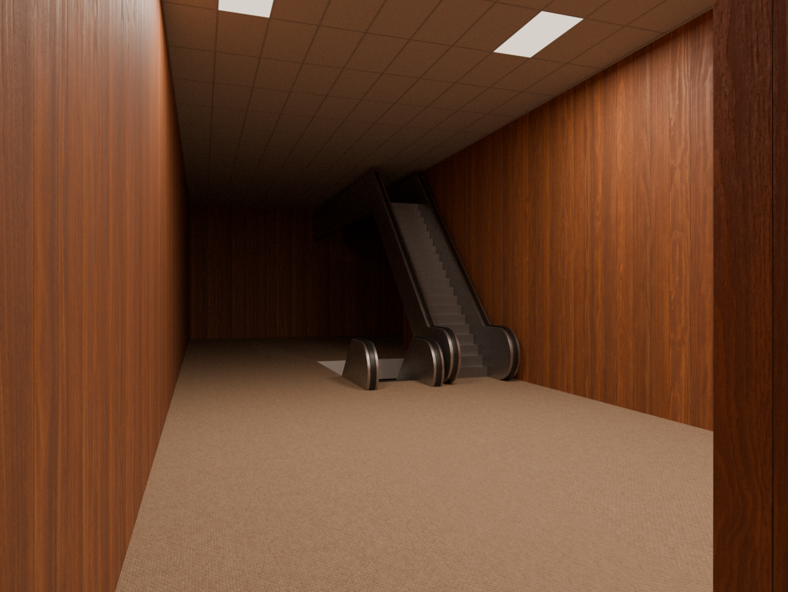
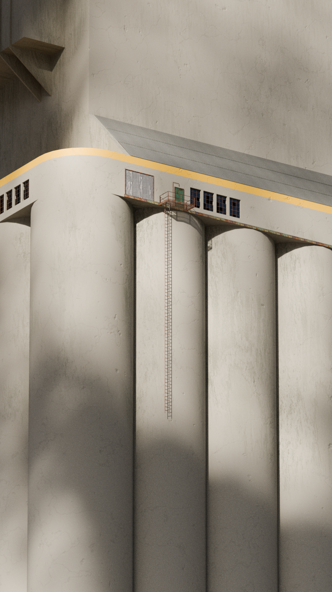

# 🫖 Blender Portfolio

Hey, I’m Rob, and this is where I keep my Blender experiments and artistic
endevours.

I’ve been learning Blender since 2024, slowly discovering how to express
different ideas through 3D art and digital renderings. After over a decade of
programming, this has become my outlet to create something beyond code, to
explore composition, shading, and lighting instead of logic.

## What is Blender?

_Blender_ is an open-source 3D creation suite for modeling, animation, and
rendering. It’s a digital sandbox where math meets imagination, and occasionally
explodes into weird, glowing geometry.

https://www.blender.org/

> Some assets used here _(models, textures, HDRIs, etc.)_ are not
> redistributable due to licensing. This repository is for demonstration only,
> not for sharing or reusing content. Please respect the original creators’
> licenses.

## Renders

  
  
  

