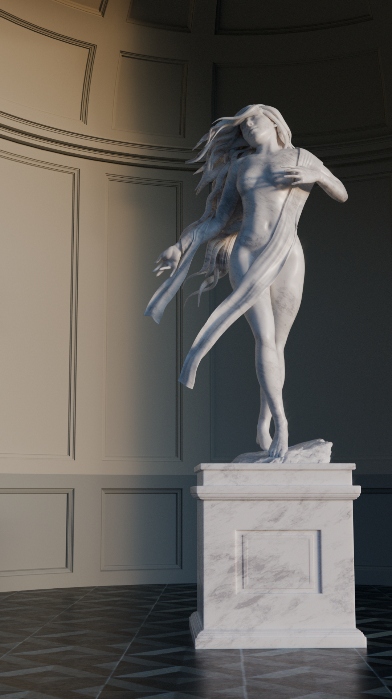
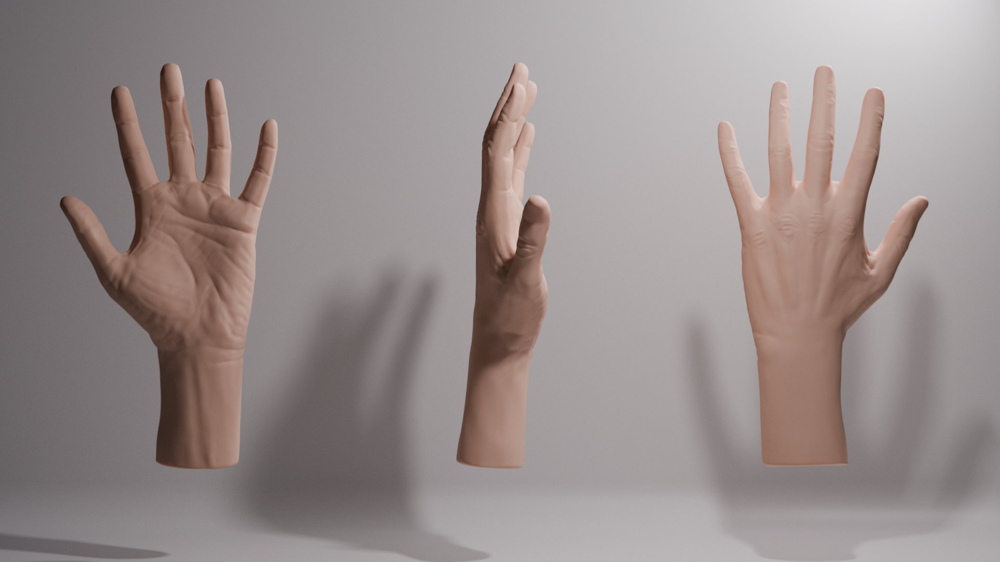
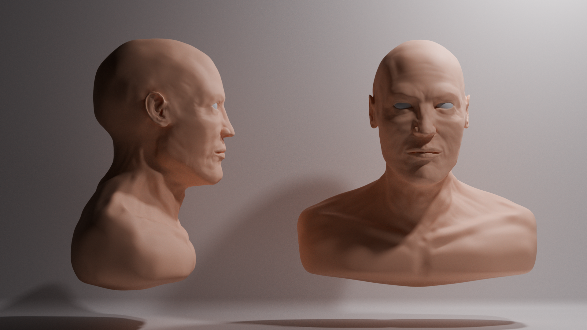
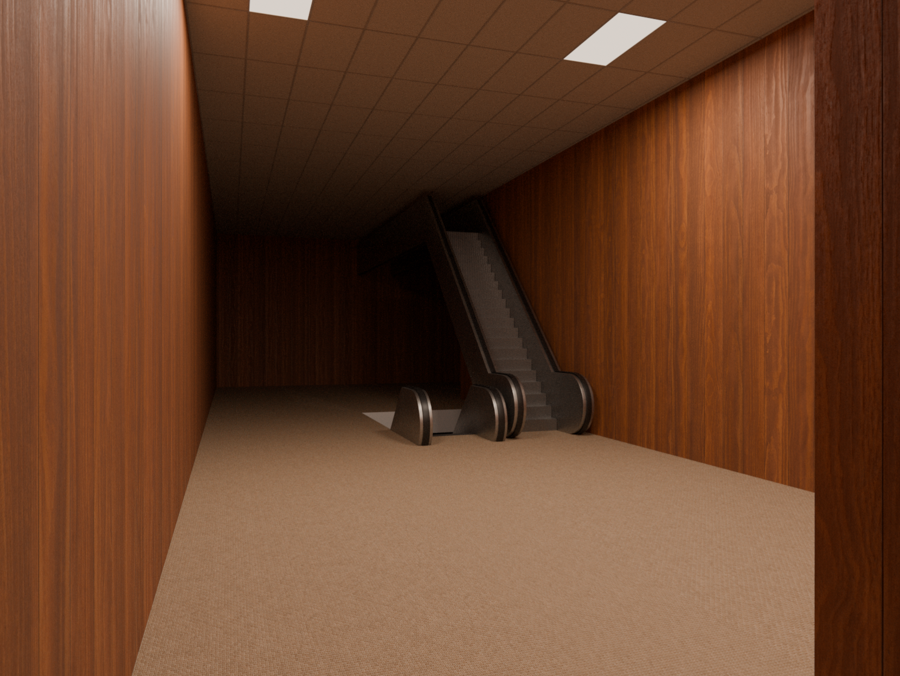
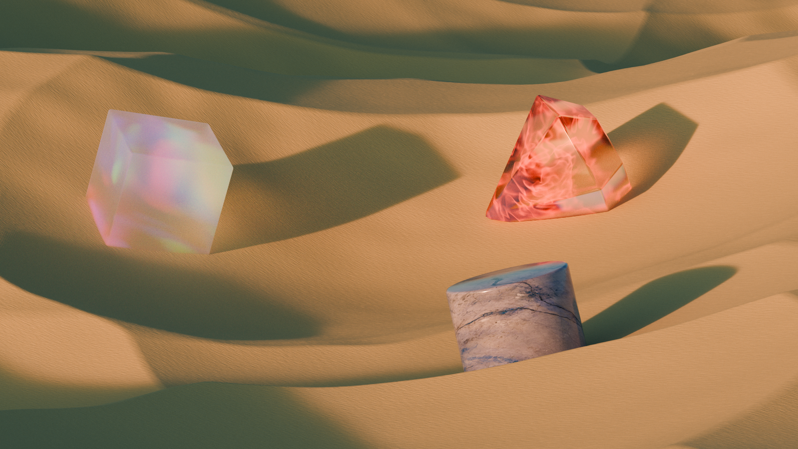
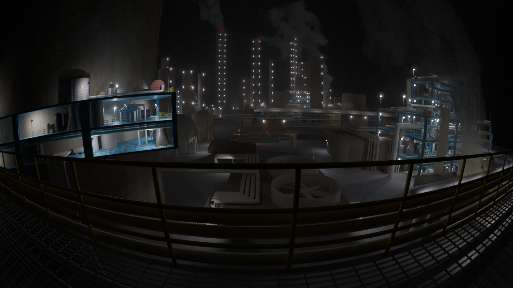
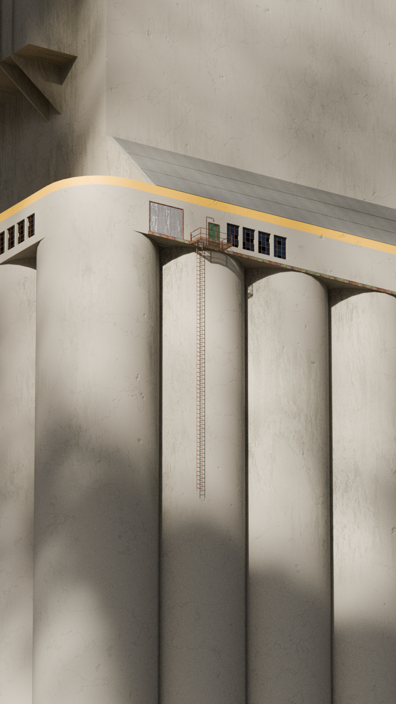

# 🫖 Blender Portfolio

Hey, I’m Rob, and this is where I keep my Blender experiments and artistic
endevours.

I’ve been learning Blender since 2024, slowly discovering how to express
different ideas through 3D art and digital renderings. After over a decade of
programming, this has become my outlet to create something beyond code, to
explore composition, shading, and lighting instead of logic.

To be clear, I have no classical training or formal background in art, which is
part of why I'm drawn to it right now. Much like when I was first introduced to
programming back in 2010, there's an ocean of things to learn and be humbled by.
I'm someone who is deeply curious, and my passions tend to drive that curiosity
forward.

_I'm not an artist, but I enjoy learning about and making art._

## What is Blender?

_Blender_ is an open-source 3D creation suite for modeling, animation, and
rendering. It’s a digital sandbox where math meets imagination, and occasionally
explodes into weird, glowing geometry.

https://www.blender.org/

> Some assets used here _(models, textures, HDRIs, etc.)_ are not
> redistributable due to licensing. This repository is for demonstration only,
> not for sharing or reusing content. Please respect the original creators’
> licenses.

## Project Layout

This repo is structured as follows. Each folder under `./projects` is organized
by project and typically includes `./refs` and `./renders` folders.

References are an important part of any artistic process, helping to ground and
guide creativity toward a goal. Sometimes the references used are more direct,
while others help inform style.

Renders, on the other hand, show what the Blender result looks like after a
chunk of work has finished. I typically work in short bursts of 1 hour daily
when I can, so each increment represents that amount of work. It's also very
useful and interesting to review my own progress and understand whether I'm
making the right creative choices on each iteration of the project. This helps
me reflect on the process.

Both refs and renders are organized as sequential files, and the format can
vary. Typically, I import the refs into the Blender files to review them
directly in Blender, but not always. Occasionally I'll use the refs as textures
in the final render result, though this is rare.

Assets, on the other hand, are general textures, fonts, and models I'll reuse
throughout my projects. Typically, these are things I didn't create myself but
use as building blocks for my work. The physically based rendering (PBR)
materials are particularly useful for emulating realistic-looking materials that
I wouldn't otherwise have the capability to generate myself.

```
├── assets                      # general reusable assets uesd in projects
└── projects
    ├── project_name
    │   ├── README.md           # describes work, process, lessons learned
    │   ├── project_name.blend  # blender file
    │   ├── refs                # artistic references used for inspiration
    │   │   ├── 1.jpeg
    │   │   ├── 2.jpg
    │   │   └── 3.webp
    │   └── renders             # incremental improvements
    │       ├── 1.png
    │       ├── 2.png
    │       ├── 3.png
    │       └── 4.png
    └── other_project
        ├── README.md
        ├── refs
        │   └── 1.png
        ├── renders
        │   ├── 1.png
        │   └── 2.png
        └── other_project.blend
```

## Projects

- _Jan 30, 2026_ - [Gas Station](./projects/gas_station/)
- _Jan 8, 2026_ - [Head Sculpt](./projects/head)
- _Jan 1, 2026_ - [Hand Sculpt](./projects/hand)
- _Dec 17, 2025_ - [Chemical Plant](./projects/chemical_plant)
- _Nov 6, 2025_ - [This Way](./projects/this_way)
- _Nov 5, 2025_ - [Dunes](./projects/dunes)
- _Nov 4, 2025_ - [Silos](./projects/silos)

## Renders

<p align="center">
  
</p>
<p align="center">
  
  
  
</p>
<p align="center">
  
  
  
</p>
<p align="center">
  
</p>
