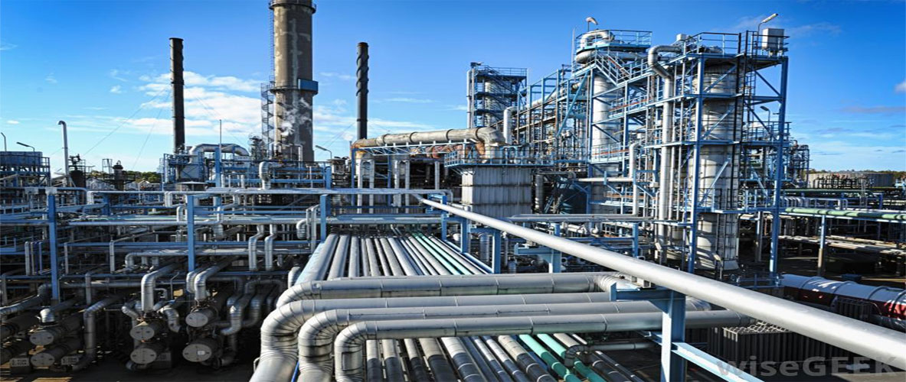
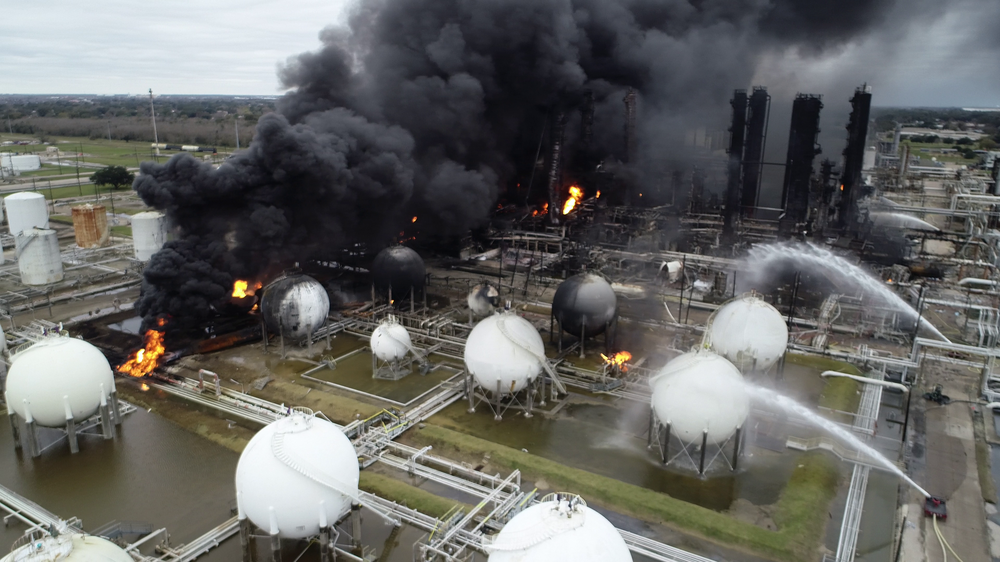
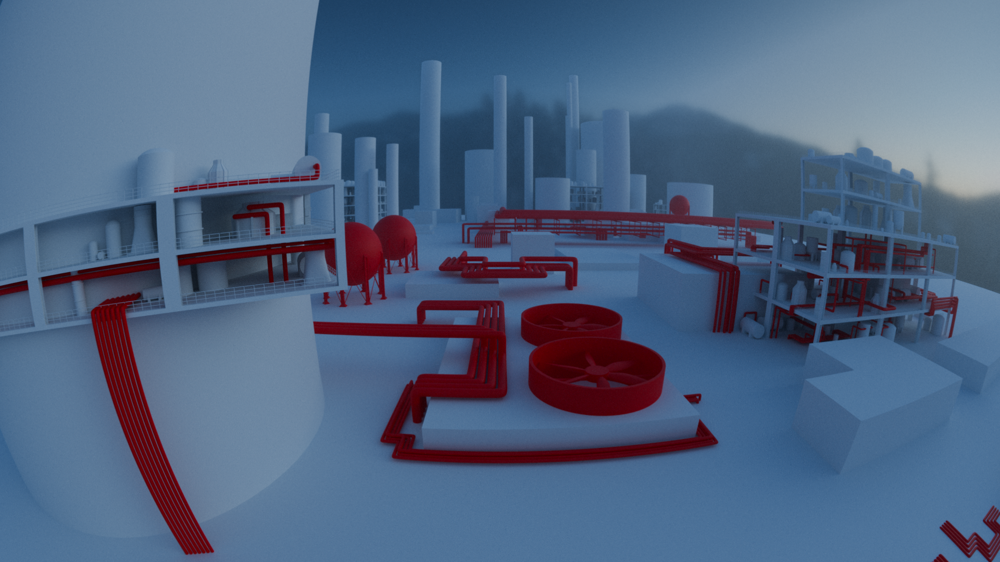

# Chemical Plant

  

## About This Work

This piece was inspired by a TikTok I came across, a video capturing the alien
geometry of an industrial chemical plant.[1] Something about it
stopped me in my tracks. It's another example of humans engineering spaces that
are fundamentally inhospitable to human presence, and that idea resonates with
me deeply. There are spaces in our lives we shouldn't try to exist in, and
chemical plants are one of the most literal expressions of that, beautiful in
their complexity, hostile in their intent.

My vision was a wide, fisheye panoramic shot[2] that would capture
the overwhelming, almost incomprehensible scale of an industrial landscape. I
wanted the viewer to feel small, like they'd stumbled into somewhere they didn't
belong.

## My Process

I started by building a library of small, reusable modular pieces that I could
scatter across the scene, a technique called kitbashing.[3] Chemical
plants are full of fascinating, almost surreal objects: pipes, tanks, reactors,
walkways. Researching references had me genuinely wondering what half of this
equipment was even for. It felt like looking at a mecha wizard's potion table.
Focusing on these individual objects at small scale kept things manageable
before I had to think about the full composition.

  
  

For scattering the buildings and structures across the scene, I started with
Geometry Nodes.[4] As a programmer, I genuinely enjoy working with
node graphs, there's a logic to them that feels familiar. But when it came to
making fine artistic adjustments, the workflow started to fight me. Geometry
Nodes are powerful at scale, but the constant need to refactor the graph every
time I wanted a small tweak slowed the creative process significantly. I
eventually converted the setup to realized instances[5] and worked
with those directly, which gave me the flexibility I needed.

  

For the smoke, I used plain photographs of smokestacks composited as a masking
layer for transparency a trick that ended up being effective.

The fisheye lens[2] was a constant challenge. The standard viewport
doesn't translate what a fisheye render will actually look like, so I spent a
lot of time toggling between viewport and rendered view to check placement and
proportions. Things I assumed would look right rarely did. That friction became
a real drag on the process, one of those small, recurring frustrations that
chips away at the enjoyment of a project.

## What I Liked

The kitbashing phase was genuinely fun. I loved spending time on each individual
piece of industrial equipment, letting myself get lost in the strange beauty of
those shapes. At a glance, the scene has a lot of repeating geometry, but it's
hard to notice, and that illusion was satisfying to pull off.

The smoke trasnparency mask shading approach worked better than I expected. It's
a simple technique, but it added a layer of atmosphere and depth that felt
cohesive with the overall mood.

And somewhere along the way the Sonic the Hedgehog Chemical Plant Zone
soundtrack started playing in my head.[6] That became a kind of
accidental thematic anchor in my head.

## Lessons Learned

The biggest recurring lesson here, one I keep having to relearn, is not to
fixate on detail that won't survive the final render. I caught myself multiple
times putting real effort into small elements, only to zoom out to camera view
and find my work amounted to two or three pixels. Understanding the right level
of detail for the camera's perspective is essential for staying energized on
long projects. Blocking things out first and then layering in detail based on
what the camera actually sees is the smarter workflow.

Geometry Nodes are a powerful tool, but they come with a real workflow cost on
complex, artistically driven scenes. The programmer in me wants to lean on them,
but knowing when to abandon a node setup and just work with realized instances
directly is something I'll carry into future projects.

The fisheye lens taught me that a non-standard camera setup demands a different
working method. I should build the habit of doing more render checks early and
often when working with anything that distorts the viewport relationship.

Looking back, I wish I'd established a grid system or some kind of compositional
guide to help move the viewer's eye through the scene. And I think compositing
work on the lighting, especially how distant light sources fall on the
buildings, would have elevated the final result considerably.

Ultimately, I'm not fully satisfied with where this one landed. I was ready to
move on before I'd fully solved it. I'd call it an honest failure, but a
productive one. I learned a lot about managing wide scenes, about the real cost
of small workflow friction points, and about knowing when detail serves the work
and when it's just burning time. I'll carry all of that into the next one.

## References

1. [Chemical plant (TikTok reference)](https://www.tiktok.com/@eliastave73/video/7559872871523175694)
2. [Fisheye lens — Wikipedia](https://en.wikipedia.org/wiki/Fisheye_lens)
3. [Kitbashing — Wikipedia](https://en.wikipedia.org/wiki/Kitbashing)
4. [Geometry Nodes — Blender Manual](https://docs.blender.org/manual/en/latest/modeling/geometry_nodes/index.html)
5. [Realize Instances Node — Blender Manual](https://docs.blender.org/manual/en/latest/modeling/geometry_nodes/instances/realize_instances.html)
6. [Sonic the Hedgehog — Chemical Plant Zone (YouTube)](https://youtu.be/-LYB7iLZNWE?si=AeVdqoC1ef68j77P)

[1]: https://www.tiktok.com/@eliastave73/video/7559872871523175694
[2]: https://en.wikipedia.org/wiki/Fisheye_lens
[3]: https://en.wikipedia.org/wiki/Kitbashing
[4]: https://docs.blender.org/manual/en/latest/modeling/geometry_nodes/index.html
[5]: https://docs.blender.org/manual/en/latest/modeling/geometry_nodes/instances/realize_instances.html
[6]: https://youtu.be/-LYB7iLZNWE?si=AeVdqoC1ef68j77P
