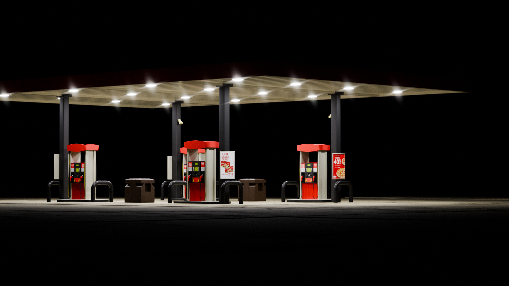
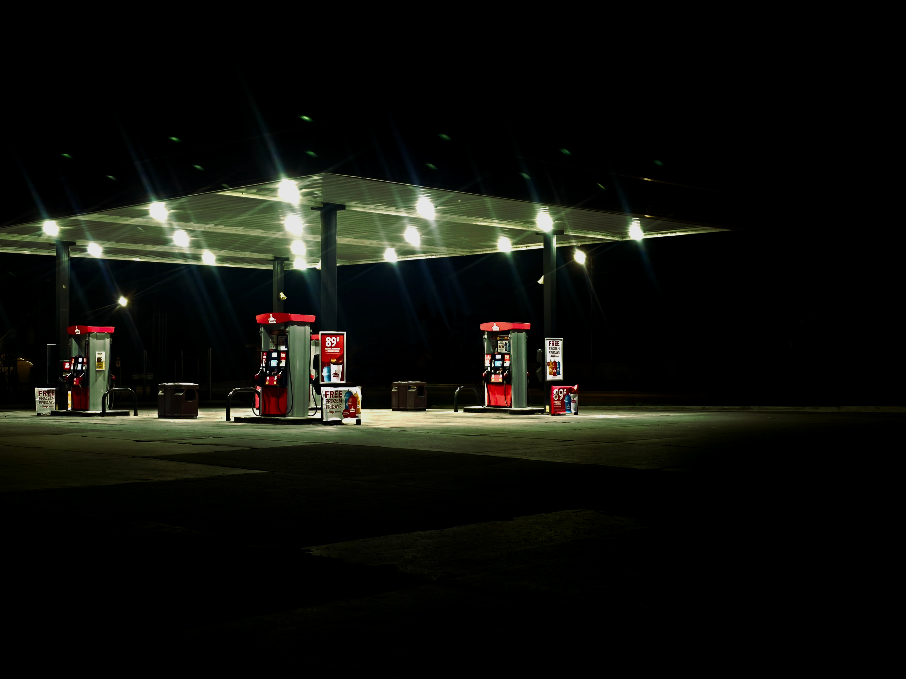
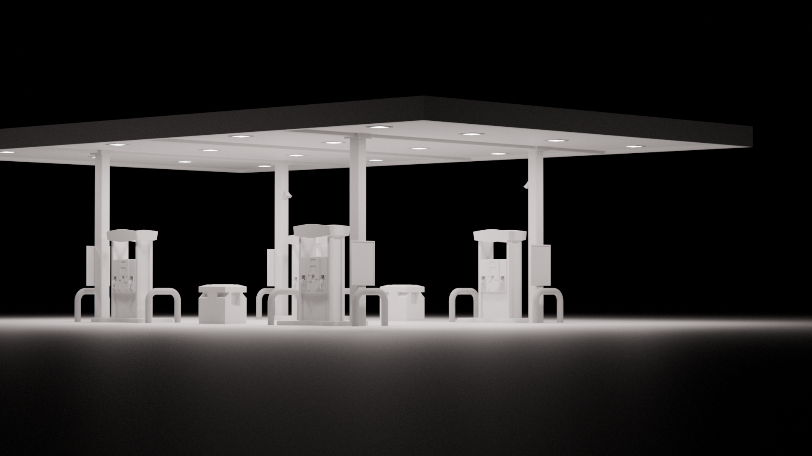
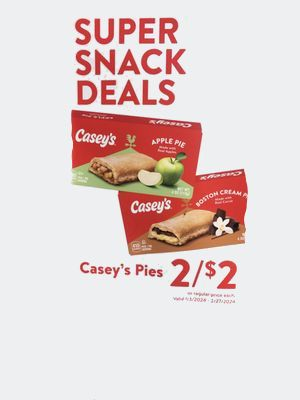
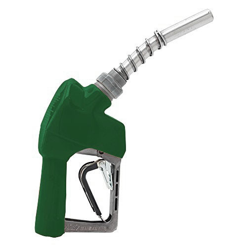

# Gas Station

  

## About This Work

Growing up in the midwest, the gas station was always more than just a place to
fill up. In small towns, it's often one of the only businesses still operating,
and it becomes this strange focal point of community life. Travelers stop in to
continue their journey. Locals stop in because it's one of the few places to go.
Retired farmers gather there in the mornings over coffee. It's a place that
holds real weight for people who know it.

But it's also a liminal space. You get in, you get out.

The initial spark came from a post I came across on
[r/LiminalSpace](https://www.reddit.com/r/LiminalSpace/comments/1oz8yci/night_shift/)
that captured exactly the feeling I'm talking about. What really stuck with me,
and what I wanted to capture, was the feeling of being at a gas station late at
night in the middle of nowhere. The place is technically open, the lights are
on, but there's no one around. A space that's usually buzzing with people in and
out suddenly feels eerie and still. Out in the country it gets genuinely dark,
and when you're remote enough you can actually appreciate the silence and the
stars while the sound of gas pumping echoes in the background. That specific
atmosphere, familiar but unsettling, is what I wanted to put into this piece.

  

## My Process

The overall composition leans into symmetry, which reflects how these gas
stations actually look. The building, the pumps, the layout: almost everything
mirrors itself. I leaned into that by making heavy use of the Mirror modifier
[1], which made iterating on models a lot more convenient. I don't
usually try to optimize my workflow since I find that doing things the hard way
reinforces learning, but at this stage it felt like the right call. Small
adjustments propagated cleanly, and it saved me real time without sacrificing
understanding.

The concrete texture was where I spent the most time and ran into the most
interesting problems. At sharp angles, the surface detail would flatten out and
look unconvincing. I ended up having to exaggerate certain features to help them
read better in the final render, which felt contradictory at first. Sacrificing
"accuracy" to achieve a more believable look is a weird thing to sit with, but
it worked. My solution combined an off-the-shelf PBR concrete shader
[2] for the color and roughness with procedurally generated noise
[3] for the normals, which I mixed with the PBR texture's normals.
This gave me layered cracks at different scales, which helps sell the illusion.
The imperfections read as shadows cast by the overhead lights, and they sit in
the periphery rather than demanding attention.

For the ceiling, I used a wave noise texture [4] to get the look of
long corrugated sheet metal panels. It's not a texture I reach for often, but it
was the right fit here.

For the gas pump screens, I went with the greenish tint you'd associate with old
DMG Game Boy [5] screens and early calculators. I had assumed that's
what gas pumps still used, and it wasn't until I actually looked into it that I
found modern pumps have full-color displays and are now showing us ads. I
deliberately kept the retro screen aesthetic anyway because it fit the story in
my mind. The idea of every inch of our lives being filled with advertising is
worth addressing, but that's a different piece.

Lighting was something I tried to approach more deliberately this time. I held
off on texturing and worked with plain white materials for a while to understand
how light would behave in the scene first. The darkness does a lot of
compositional work, functioning as a natural vignette to draw the eye toward the
subject.

  

For compositing [6], I kept it minimal but used it to generate lens
flare and a slight fogginess around the lights, which would have been awkward to
fake in the shader. The UV editor [7] came in handy for the signage
and branding, since I was working with low-resolution reference images found
online, some of which weren't shot straight on. Mapping the perspective
distortion to a flat square in the UV editor was enough to make it work at
render distance.

  
  

One small intentional detail: the megaphones on the station are not symmetrical,
breaking from the overall mirror logic everywhere else. A minor subversion, but
it adds a layer of detail that makes the scene feel less constructed.

## What I Liked

The atmosphere landed close to what I had in mind. The darkness, the stillness,
the overhead lights cutting through it all: it feels like a place I've actually
stood in.

The concrete texture result made me happy, especially because it came from
solving a real problem rather than just following a tutorial. The cracks and
imperfections sit exactly where I wanted them, present but not distracting.

I was also genuinely pleased with how the level-of-detail decisions played out
_(aside from the pump handles which I'll talk about later)_. The signage and
typography look convincing at render distance despite the low-quality source
images, and I didn't spend hours trying to make them perfect up close. It felt
like the first time I consciously understood when something was detailed enough.
I think that came from doing better planning and blocking earlier in the
process. Spending more time planning meant I wasted less time layering in
details later.

## Lessons Learned

The biggest technical takeaway was the concrete shader work. Mixing procedural
noise normals [3] with PBR normals [2] to get layered
surface detail is something I'll carry into future projects. It was also a good
reminder that physical accuracy and perceptual realism aren't always the same
thing.

I also got my first real use out of the Mirror modifier [1] as an
actual workflow tool rather than just something to know about. Using it properly
here showed me where optimization is worth adopting even when I generally prefer
to work the long way.

On the flip side, I over-detailed the gas pump handles. They're tiny in the
final render and I was working way too zoomed in, which led to adding geometry
and bevels that contribute nothing at the intended scale. That's a habit I want
to break: always keeping the camera's perspective in mind while modeling rather
than getting lost in geometry that won't matter.

  

Working with plain white materials to establish lighting before texturing is a
practice I want to keep using, and honestly it's hard to overstate how important
lighting is to a render. In older projects I would treat lighting as an
afterthought, something to sort out at the end once everything else was in
place. That's backwards. Lighting shapes how every material, texture, and model
reads in the final image, and trying to fix it late in the process means you're
compensating for decisions that were made without it. Getting the light right
early means everything layered on top of it is built with the full picture in
mind.

## References

1. [Blender Mirror Modifier Documentation](https://docs.blender.org/manual/en/latest/modeling/modifiers/generate/mirror.html)
2. [Physically Based Rendering (PBR) on Wikipedia](https://en.wikipedia.org/wiki/Physically_based_rendering)
3. [Blender Noise Texture Node Documentation](https://docs.blender.org/manual/en/latest/render/shader_nodes/textures/noise.html)
4. [Blender Wave Texture Node Documentation](https://docs.blender.org/manual/en/latest/render/shader_nodes/textures/wave.html)
5. [Game Boy on Wikipedia](https://en.wikipedia.org/wiki/Game_Boy)
6. [Blender Compositing Documentation](https://docs.blender.org/manual/en/latest/compositing/index.html)
7. [Blender UV Editor Documentation](https://docs.blender.org/manual/en/latest/editors/uv/index.html)

[1]: https://docs.blender.org/manual/en/latest/modeling/modifiers/generate/mirror.html
[2]: https://en.wikipedia.org/wiki/Physically_based_rendering
[3]: https://docs.blender.org/manual/en/latest/render/shader_nodes/textures/noise.html
[4]: https://docs.blender.org/manual/en/latest/render/shader_nodes/textures/wave.html
[5]: https://en.wikipedia.org/wiki/Game_Boy
[6]: https://docs.blender.org/manual/en/latest/compositing/index.html
[7]: https://docs.blender.org/manual/en/latest/editors/uv/index.html
