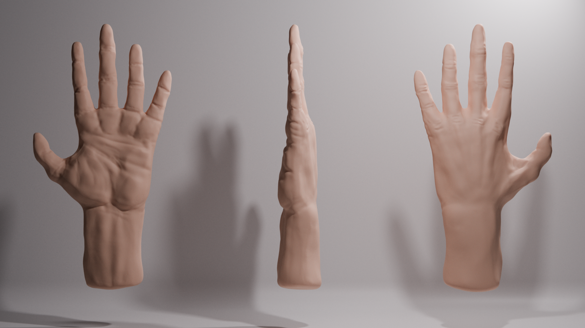

# Hand Sculpt

  

## About This Work

This piece is a study of the human hand, one of the most anatomically complex
and recognizable subjects you can attempt to model. There wasn't a grand
artistic vision behind it; this was primarily an exercise in understanding form.
I wanted to observe, break down, and reconstruct something familiar through
sculpting, and the hand felt like the right challenge at the time.

It also marked my first experiment using a digital drawing pad[1]
with Blender's sculpt mode[2] so the piece was as much about learning
a new input device as it was about the subject itself. A personal study, plain
and simple.

## My Process

I started in sculpt mode, roughing out the primary shapes with brushes like
_Draw_ and _Grab_ to establish the overall silhouette. Early on I leaned too
heavily into the underlying skeletal structure, you can see it in the early
renders: the hand looks boney and stiff, more anatomy diagram than living
tissue. The knuckles and joints are over-emphasized, and the soft tissue that
fills and softens everything is largely absent.

  

Coming back to the project after working on my head sculpt gave me a fresh
perspective. Two weeks between renders two and three, but I returned with better
instincts about how fat and skin drape over bone. I softened transitions, added
more volume to the palm and finger pads, and used the _Smooth_ brush more
aggressively to push away from that skeletal rigidity.

I found the lighting and multiple perspectives of the objects helped me study
the shadows, seeing how light wraps around the knuckles and falls into the
creases gave me useful feedback on where the form was working and where it
wasn't.

One of the more practical wins from this project was learning how to reference
geometry across multiple objects without duplicating mesh data[3],
keeping the disk footprint of a single model while presenting three different
camera perspectives in the final render. A small thing, but it clicked something
into place about how Blender handles object data.

## What I Liked

I'm genuinely happy with how the final render turned out compared to where it
started. The progression from render one to render three tells an honest story
of iteration, which I think is worth showing rather than hiding.

The three-perspective layout also works well. It gives a complete picture of the
form without needing to animate or present multiple files, and the linked
geometry trick made that feel clean and efficient.

Mostly though, I'm proud that it looks like a hand. That sounds like a low bar,
but given how many of my earlier sculpting attempts went sideways, finishing
this and having it be _recognizable_, even refined, was a real affirmation.

## Lessons Learned

The biggest technical lesson was learning to see past the skeleton. Anatomy
references are useful, but fixating on bone structure without accounting for the
soft tissue that surrounds it leads to something that looks like an x-ray more
than a hand. Fat pads, skin folds, and the way flesh compresses and stretches,
these are what make organic forms feel alive.

I also got meaningfully more comfortable with the digital drawing pad. There's a
learning curve to pressure sensitivity and stylus control that I hadn't
anticipated, and this project forced me to work through it.

The linked geometry / object data referencing was a practical workflow concept
I'll carry into future projects, especially when presenting multi-angle studies.

What I'd do differently: start with softer, rounder masses and work inward
toward structure rather than building out from the skeleton. For my next sculpts
I want to start experimenting with the Multiresolution Modifier[4] to
improve my workflow with managing vertices at multiple levels.

There's still room to improve here, skin texture, pores, fingernail detail, but
I was satisfied enough to call it done. Like the head sculpt, this turned out
better than I expected, and that surprise keeps me going. Programming gave me
that same feeling once, and I've slowly lost it there. Here, I'm still finding
it.

## References

1. [Blender — Tablet Input](https://docs.blender.org/manual/en/latest/editors/preferences/input.html#tablet)
2. [Blender — Sculpt Mode](https://docs.blender.org/manual/en/latest/sculpt_paint/sculpting/introduction/index.html)
3. [Blender — Linked Duplicates (Alt+D)](https://docs.blender.org/manual/en/latest/scene_layout/object/editing/duplicate_linked.html)
4. [Blender — Multiresolution Modifier](https://docs.blender.org/manual/en/latest/modeling/modifiers/generate/multiresolution.html)

[1]: https://docs.blender.org/manual/en/latest/editors/preferences/input.html#tablet
[2]: https://docs.blender.org/manual/en/latest/sculpt_paint/sculpting/introduction/index.html
[3]: https://docs.blender.org/manual/en/latest/scene_layout/object/editing/duplicate_linked.html
[4]: https://docs.blender.org/manual/en/latest/modeling/modifiers/generate/multiresolution.html
