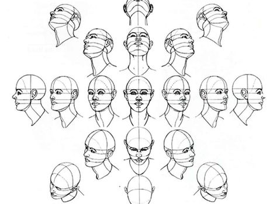
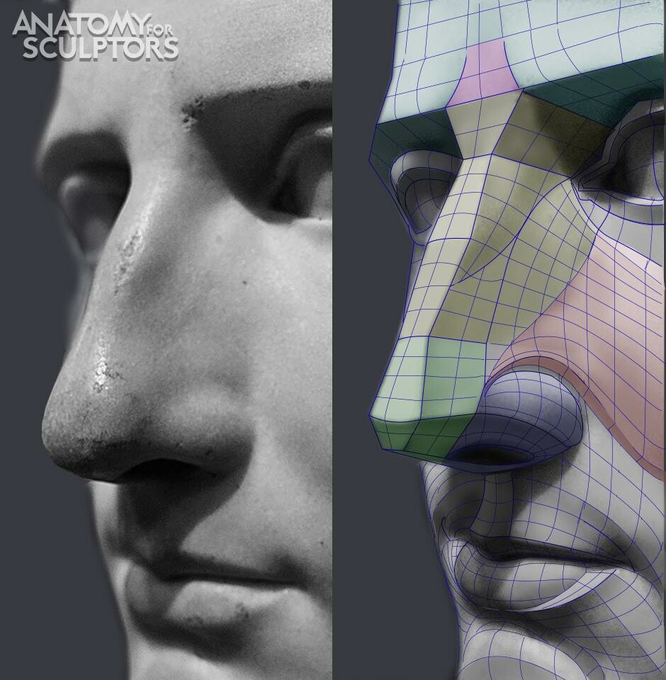
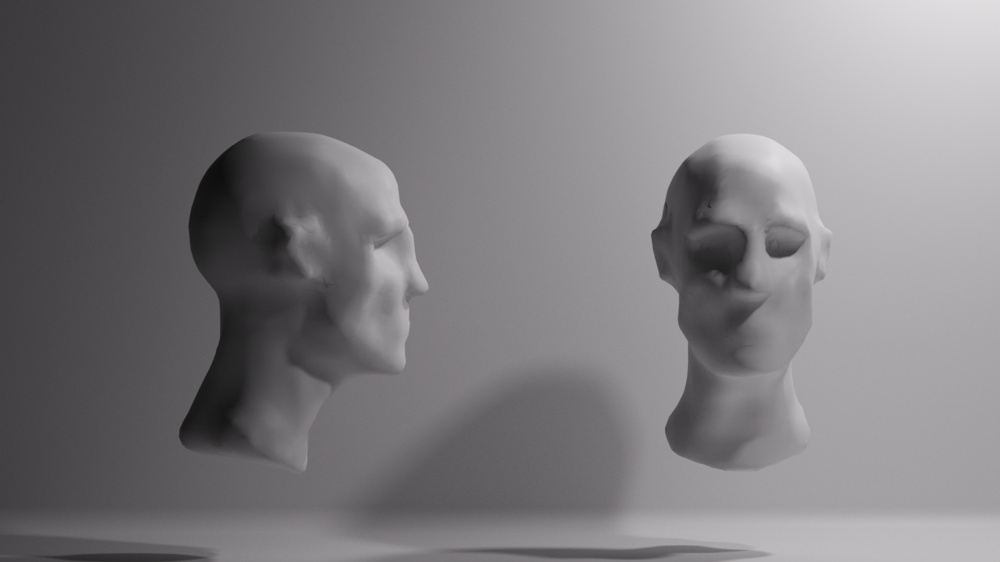
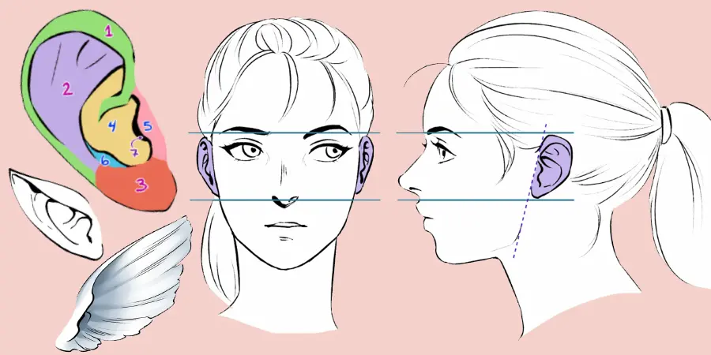
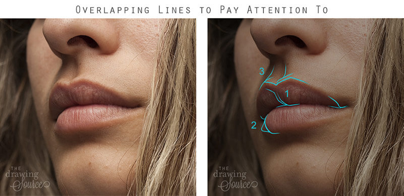
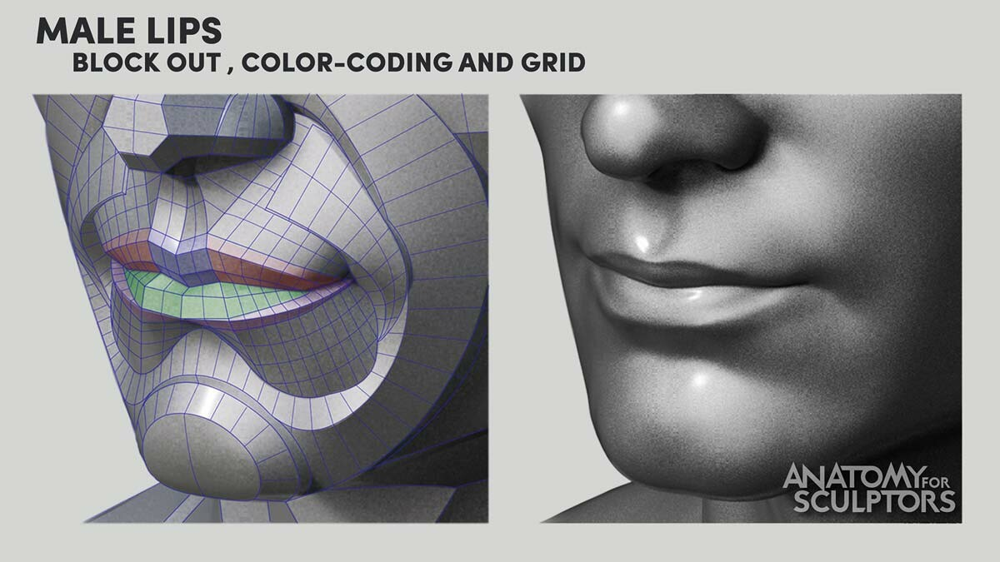

# Head Sculpt

  

## About This Work

This is a realistic male head sculpt I created as part of my journey into
digital sculpting with Blender. Getting a Wacom Intuos tablet for Christmas was
the catalyst, I'd tried sculpting before with just a mouse, but it felt
limiting, like trying to paint with oven mitts on. The tablet opened up a whole
new world of what felt possible.

I didn't have a specific character in mind for this piece. Instead, I approached
it as a fundamental study: learning the anatomy, understanding the forms,
building the foundation I'd need for future work. The goal was realism over
stylization, which meant really getting into the details of how a human head is
actually constructed.

This turned into my most reference-heavy project yet. I downloaded more anatomy
references for this than anything else I've worked on, diving deep into the
shapes that make up our faces.

  
  

## My Process

I started with basic geometry and worked my way up, manually subdividing as I
added detail rather than using dynamic topology. Looking back, dynamic topology
might have been more efficient with vertex management, but the manual approach
helped me stay intentional about where I was adding complexity.

  
  

For reference, I used a 3D skull model to understand the underlying structure,
not as a direct base, but as a guide for how bone shapes the surface forms we
see. That foundation was crucial.

My main tools were the fundamentals: clay strips for building up forms, smooth
for blending, crease for defining edges, and draw sharp for harder details.
Nothing fancy, just the basics used thoughtfully.

The anatomy research was eye-opening. The Y-shaped structure inside the ear
completely changed how I look at faces now. There's so much hidden geometry in
the human form that goes unnoticed until you try to recreate it. It's
recontextualized how I see people day to day, I notice the planes, the
transitions, the subtle asymmetries.

  

### The Challenges

The lips were frustrating for a while. I had to experiment with different
brushes and approaches to get the clay to behave the way I wanted, to capture
that soft complexity where the lip tissue meets the surrounding skin.

  
  

The ears took time too, but honestly, I was surprised by how they turned out.
All that studying of the Y-shape and the various folds paid off.

### Workflow Decisions

I kept my viewport at a higher focal length (around `100mm`) to get closer to an
orthographic projection. Lower focal lengths distort the model when you're
working up close, which can throw off your proportions without you realizing it.
This was a game-changer for maintaining accurate forms. I'll probably stick to
100m for all my project viewports from now on.

## What I Liked

I'm genuinely surprised by how this turned out. This is some of my earliest
serious work in 3D sculpting, and it's something I never thought I'd be able to
do well enough to feel comfortable sharing. That's a huge milestone for me.

The overall anatomy reads correctly, the bone structure underneath is
influencing the surface forms in believable ways. Understanding that
relationship between what's beneath and what we see was key, and I think it
shows in the final result.

The ears worked out better than expected. After struggling with them, seeing
them come together felt like a breakthrough moment.

## Lessons Learned

**Reading shadows is everything.** Good sculpting is as much about understanding
how light reveals form as it is about pushing vertices around. I found myself
constantly rotating the model, checking how the shadows fell across different
planes, using that feedback to refine the forms.

**Anatomy knowledge transforms the work.** Learning about the underlying
structures, how bones create landmarks, how muscle groups create transitions,
completely changed my approach. A lot of the shapes in our body are influenced
by what's underneath, and thinking about that invisible structure helps inform
the visible one.

**The learning compounds fast.** Right after finishing this, I went back to a
hand sculpt I'd done earlier and immediately saw a dozen ways to improve it. The
skills from this project transferred directly, and I was able to level up that
older work in ways I couldn't have before.

**Technical limitations matter.** I wanted to add more subdivision for finer
skin details, but GitHub's `100MB` file limit prevented me from going further. I
experimented with it briefly, but at my current vertex count, another
subdivision would have pushed me over. It's a frustrating constraint that
affected the final detail level I could achieve.

### Areas to Improve

I struggled with certain areas and could definitely get better at:

- Better planning around file size constraints
- Skin detail techniques that work within polygon budgets

### What's Next

This feels like touching the surface of an ocean. I'd love to study:

- Full body anatomy
- The differences between male and female facial structure
- Age variation, how to make a face read as younger or older
- Character development beyond generic studies
- How to implement retopology into simpler models, while retaining detail

I also need to solve the `100MB` GitHub limit problem without spending a fortune
on storage. And eventually, I want to revisit this model with fresh eyes and
improved skills, though I suspect I need to learn a few more things before I'm
ready to take another pass at it.

For now, I'm calling this piece done, not perfect, but a genuine marker of where
I am in this journey. And I'm proud of that.
