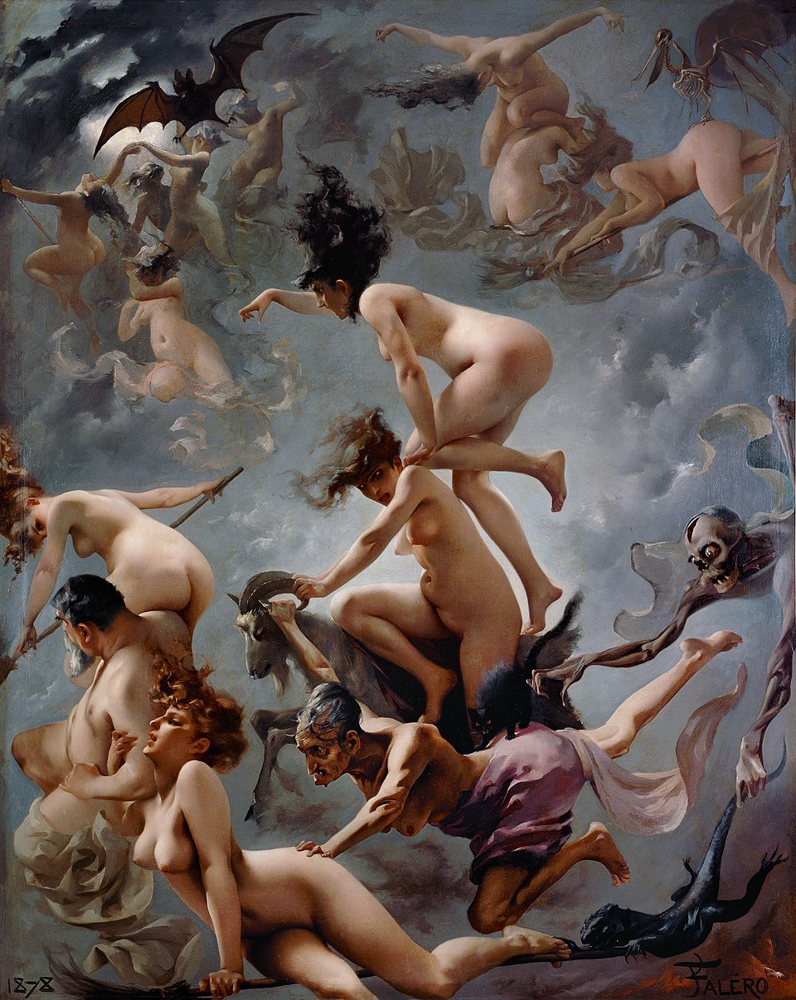
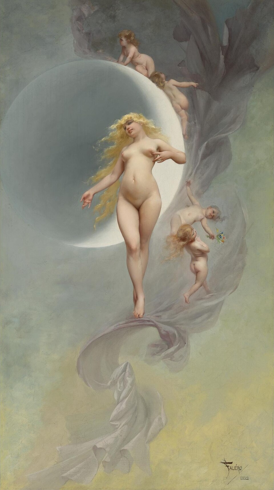
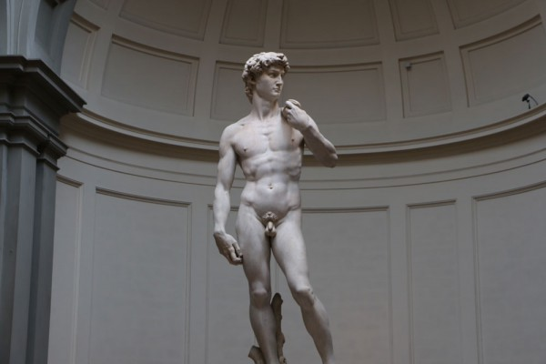
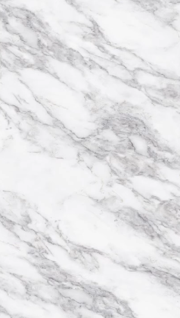
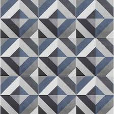
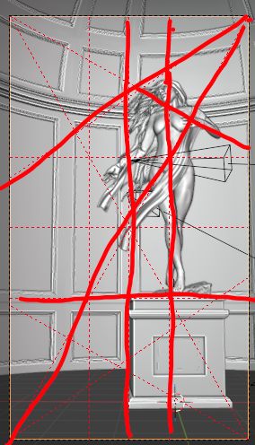

# Silhouette

  

## About This Work

This piece was rooted in a desire to practice sculpting the human form and
explore techniques I'd been picking up from studying classical paintings. My
goal wasn't to replicate a painting, but to absorb some of that sensibility and
bring it into a 3D space.

The primary inspiration was Luis Ricardo Falero[13], a Spanish
painter whose work isn't widely known and belongs largely to private
collections. What draws me to him is the ethereal, weightless quality of his
subjects and his emphasis on the female form. "Witches going to their Sabbath"
is particularly striking to me, and I leaned on "The Planet Venus" when thinking
through the pose and presence of the marble figure.

  
  

The setting was influenced by Michelangelo's David and the gallery room it
occupies at the Galleria dell'Accademia in Florence. Rather than sculpting a
figure in isolation, I wanted to put it in a space that felt considered and
architectural.

  

The camera is set to a 50mm focal length[1], slightly lower than what
I've used in recent work. I wanted to push the perspective a little more,
positioning the viewer at eye level with an average-height person looking up at
the figure, which I felt reinforced the sense of scale and reverence.

## My Process

I started by trying to model the body from scratch, but quickly realized I'd
bitten off more than I could chew. I ended up using the "Body Female - Primitive
(Realistic)" asset from the open-source Blender asset library[2] as a
base, then posed and sculpted details on top of it. I was a bit disappointed
about that at first, since sculpting from scratch was part of what I set out to
do. But I came around to it. Sculpting on top of an existing base still took
real work, and it let me focus on other aspects.

For the surrounding architecture, I kept things deliberately simple. I relied on
custom bevel curves[3], array modifiers[4], and simple
deform modifiers[5] applied to very primitive geometry. The goal was
the look of classical columns and archways without getting lost in geometric
complexity.

The hair I used curve objects with bevel profiles[6] to generate a
stylized, flowing hair look. It was efficient and the result was more than good
enough. I didn't spend a lot of time finessing individual strands, and that felt
like a good tradeoff.

The marble shader was built from layered noise textures[7], tuned by
studying reference photos of real Italian marble. I also added subsurface
scattering[8] since marble, like human skin, allows light to
penetrate slightly rather than reflecting entirely off the surface. That
translucency is part of what makes marble feel alive rather than like painted
stone.

  

For the floor, I used a repeating texture with noise-driven roughness variation
to break up the uniformity, and adjusted the color curves to nudge the
saturation up slightly.

  

The cloth was handled with cloth simulation and wind physics[9],
which got me most of the way there. Where the simulation didn't cooperate, I
went back in and used sculpting to make fine adjustments. That combination felt
satisfying as a workflow.

Lighting was set up to bisect the figure and create strong contrast, aimed at
evoking early morning light.

One of the most significant decisions in this piece was taking composition
seriously. I used the rule of thirds[10], the golden
ratio[11], and the harmonic triangle[12] to establish
guiding lines before finalizing the render. The figure and her hair follow the
triangle from the top right to the bottom left, the left arm and cloth reinforce
it, and the pedestal sits at the bottom third. My wife Hannah, who has a
background in graphic design, shared some books on grids and composition that
I've been working through, and talking through the piece with her helped me see
how much of visual art is fundamentally anchored in these structures.

  

## What I Liked

The thing I'm most proud of is how the composition came together. Piecing the
guiding lines through the render felt like assembling a puzzle, and once it
clicked, the image felt more cohesive than anything I've done before. It's
something I can now point to and say: this is what was missing from my earlier
work.

The marble shader turned out well. The subsurface scattering gives the material
a softness that I think reads as believable, even if the sculpture itself takes
some liberties with what's realistically achievable in carved marble.

The hair technique was a pleasant surprise in terms of efficiency. Getting a
convincing result with relatively simple curves felt like a good tool to have in
the toolkit.

The cloth also worked out better than I expected. I was genuinely worried going
in, since physics simulations often don't do what you want them to, but
combining the simulation with manual sculpting afterward gave me enough control
to make it work.

## Lessons Learned

Composition is the clearest lesson from this piece. I've known about the rule of
thirds since a photography class in high school, but I hadn't been applying it
deliberately in my 3D work. Studying how Falero used grids in "Witches going to
their Sabbath" was eye-opening. So much of what's happening in that painting is
organized around underlying structure, and I hadn't fully appreciated that until
now. I'm planning to experiment with different grid systems in future work.

On the sculpting side, I still have a long way to go. Starting from a base mesh
instead of sculpting from scratch was the right call for this piece, but it's
something I want to tackle properly in the future. Sculpting a full figure from
scratch is still on the list.

I also think the contrast and exposure could be refined further. In hindsight,
I'd spend more time there before calling it done.

The big skills I want to keep developing: sculpting the human form from scratch,
and continuing to study composition. Those two feel like they'll shape the
quality of whatever comes next more than anything else.

## References

1. [Focal Length in Photography and Rendering (Wikipedia)](https://en.wikipedia.org/wiki/Focal_length)
2. [Blender Demo Files](https://www.blender.org/download/demo-files/)
3. [Bevel Modifier (Blender Docs)](https://docs.blender.org/manual/en/latest/modeling/modifiers/generate/bevel.html)
4. [Array Modifier (Blender Docs)](https://docs.blender.org/manual/en/latest/modeling/modifiers/generate/array.html)
5. [Simple Deform Modifier (Blender Docs)](https://docs.blender.org/manual/en/latest/modeling/modifiers/deform/simple_deform.html)
6. [Curve Objects and Bevel (Blender Docs)](https://docs.blender.org/manual/en/latest/modeling/curves/properties/geometry.html)
7. [Noise Texture Node (Blender Docs)](https://docs.blender.org/manual/en/latest/render/shader_nodes/textures/noise.html)
8. [Subsurface Scattering (Wikipedia)](https://en.wikipedia.org/wiki/Subsurface_scattering)
9. [Cloth Simulation (Blender Docs)](https://docs.blender.org/manual/en/latest/physics/cloth/index.html)
10. [Rule of Thirds (Wikipedia)](https://en.wikipedia.org/wiki/Rule_of_thirds)
11. [Golden Ratio (Wikipedia)](https://en.wikipedia.org/wiki/Golden_ratio)
12. [Compositional Harmony Triangle (Wikipedia)](https://en.wikipedia.org/wiki/Diagonal_method)
13. [Luis Ricardo Falero (Wikipedia)](https://en.wikipedia.org/wiki/Luis_Ricardo_Falero)

[1]: https://en.wikipedia.org/wiki/Focal_length
[2]: https://www.blender.org/download/demo-files/
[3]: https://docs.blender.org/manual/en/latest/modeling/modifiers/generate/bevel.html
[4]: https://docs.blender.org/manual/en/latest/modeling/modifiers/generate/array.html
[5]: https://docs.blender.org/manual/en/latest/modeling/modifiers/deform/simple_deform.html
[6]: https://docs.blender.org/manual/en/latest/modeling/curves/properties/geometry.html
[7]: https://docs.blender.org/manual/en/latest/render/shader_nodes/textures/noise.html
[8]: https://en.wikipedia.org/wiki/Subsurface_scattering
[9]: https://docs.blender.org/manual/en/latest/physics/cloth/index.html
[10]: https://en.wikipedia.org/wiki/Rule_of_thirds
[11]: https://en.wikipedia.org/wiki/Golden_ratio
[12]: https://en.wikipedia.org/wiki/Diagonal_method
[13]: https://en.wikipedia.org/wiki/Luis_Ricardo_Falero
