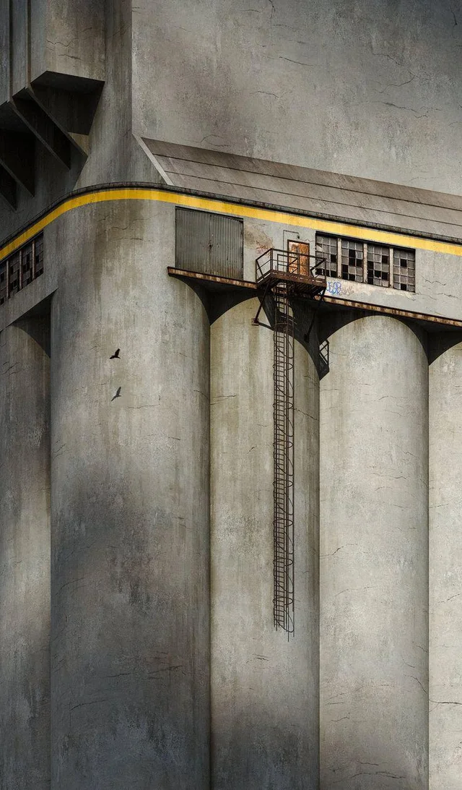

# Silos

  

## About This Work

This project emerged from my fascination with liminal spaces—those uncanny
environments that feel familiar yet fundamentally wrong for human occupation. I
came across a reference image on the liminal space subreddit that completely
captivated me: a structure with ladders leading to fatal drops and doors opening
into nothing. It embodied everything I find compelling about these spaces.

  

What draws me to liminal imagery is how it speaks to the same emotional register
as nostalgia. These are spaces built by humans but that actively reject human
presence, not designed for population but for some other purpose we can only
guess at. There's something prophetic about them, like they represent humanity's
trajectory of building environments increasingly unfit for ourselves—spaces
meant for unseen entities or functions we don't quite understand.

Looking at that reference photo, I kept asking myself: What was this space
actually used for? How did people access it? The ladder that leads nowhere, the
doors that open to deadly falls—everything about it suggests industrial purpose
while being utterly hostile to human norms we take for granted.

This was my first project after a six-month hiatus. I'd been exploring other
interests, which is normal for me—modeling is fun, but my creative attention
tends to shift throughout the year. Coming back to Blender meant shaking off
considerable rust.

## My Process

Recreating this liminal space meant building large, relatively simple geometric
forms—the silos themselves don't have intricate surface details or complex
shapes. This simplicity became its own challenge.

I focused on getting the proportions and placement right to capture that
unsettling quality from the reference. The ladders and doors needed to feel
functional enough to be believable but positioned in ways that violate our
expectations of safety and access.

The biggest technical hurdle was making these plain cylindrical forms feel real
and interesting. Without natural shadows cast by surface detail or architectural
complexity, I had to lean heavily into shader work. This was new territory for
me—I'd never had to compensate for lack of geometric detail purely through
materials and lighting.

I experimented with using noise textures combined with opacity to simulate cloud
shadows moving across the surfaces. This technique ended up working surprisingly
well, adding visual interest and a sense of atmospheric depth that the geometry
alone couldn't provide.

## What I Liked

The cloud shadow technique was definitely the highlight for me. Using noise and
opacity to generate those fake shadows brought life to surfaces that would
otherwise feel flat and lifeless. It's one of those solutions that feels
clever—working smarter rather than harder.

I'm also glad I pushed through the rust and actually finished this after my
break. It would've been easy to abandon it when I realized how challenging the
shader work would be.

## Lessons Learned

_The main takeaway_: when you're modeling large objects that lack surface
detail, you're committing yourself to serious shader work. I underestimated how
much effort would be needed to make simple forms feel convincing. Shadows,
texture variation, and material complexity have to carry the entire visual load.

The noise-and-opacity cloud shadow technique is now in my toolkit, which feels
valuable.

Honestly, I wasn't satisfied with the end result. There's a gap between what I
saw in my mind and what I managed to create. I think I needed more experience
with architectural materials and lighting to really nail the atmosphere. The
liminal quality I was chasing, that sense of wrongness and disquiet, didn't
quite land the way I wanted.

If I revisited this, I'd spend more time studying how industrial materials
weather and age. I'd also experiment more with lighting angles and color
temperature to enhance that unsettling mood. And maybe I'd add subtle geometric
details, wear patterns, panel seams, something to give the shaders more to work
with without compromising the stark simplicity.

I want to develop my shader skills further, particularly for architectural and
industrial subjects. And I'd like to get better at previsualization, being able
to predict what techniques will be necessary before I'm deep into a project.
