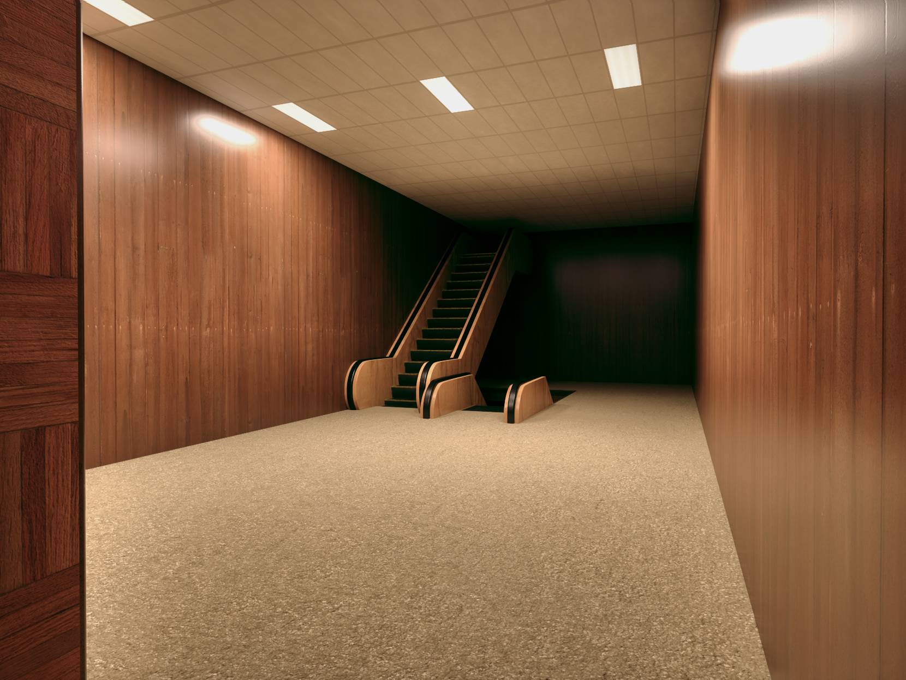

# This Way

  

## About This Work

This project continued my exploration of liminal spaces, following the same
fascination that drove the [Silos](../silos/) piece. I'm drawn to these
environments that exist in this strange space between familiar and fundamentally
wrong, places built by humans but not meant to be inhabited, only briefly
transitioned through.

The reference image for this one had a detail that completely changed how I
understood it: the escalator leads nowhere. I missed this on my first look, and
up until that point, I was debating whether the reference was a real photograph
or generated. Once I noticed the escalator's destination _(or lack thereof)_, I
became pretty confident it was generated. But that detail also gave the image a
new layer of meaning it perfectly embodied the idea of spaces built for
transition but hostile to actual use.

  

What really struck me about the scene was the carpet. You don't typically see
escalators with carpeted surroundings. Escalators live in high-traffic areas,
which means dirt _(lots of it)_ and dirt embeds itself into carpet fibers. But
this space is pristine, untouched. _It makes you wonder_: has anyone actually
been here before? The wood paneling adds to this unsettling quality too, giving
everything a retro aesthetic that suggests "this has probably been around for a
while, but somehow remains unseen."

These little contradictions and questions are what I wanted viewers to
experience when looking at my render.

## My Process

Like the silos project, the modeling work here was relatively
straightforward simple geometric forms that required the shading and texturing
to carry the visual weight.

The escalator was the centerpiece, and I needed it to lead nowhere in a way that
felt both intentional and wrong. Getting the proportions and angles right to
capture that unsettling quality took some iteration.

The rubber handrails on the escalator became an interesting challenge. I
experimented with subsurface scattering to capture how light interacts with that
material, the way it has a slight translucency and warmth. This was new territory
for me, and getting it to look right required quite a bit of tweaking.

For the escalator steps, I used wave-generated textures to create the vertical
grating pattern instead of relying on super detailed texture maps. This
procedural approach felt more efficient and gave me better control over the
result. I'm starting to appreciate how versatile procedural textures can
be, they're like having an adjustable toolkit rather than being locked into
whatever a texture file gives you.

The carpet, wood paneling, and overall lighting setup required attention to sell
that retro, slightly off atmosphere. Everything needed to feel clean but also
somehow forgotten.

## What I Liked

I was genuinely happy with how the rubber handrails turned out. The subsurface
scattering gave them that subtle translucent quality that makes rubber feel
real, there's a warmth to how light passes through it that's hard to fake any
other way.

The wave texture technique for the escalator steps was a breakthrough moment.
Being able to generate that grating pattern procedurally without hunting for or
creating detailed textures felt like unlocking a new skill. It's making me
realize how much power there is in understanding Blender's procedural texture
nodes.

Overall, I felt satisfied with this result in a way I didn't with the silos. The
concept landed better, and the execution felt closer to my vision.

## Lessons Learned

The biggest realization: good art reveals itself gradually. The details that
make you pause and study an image, like that escalator leading nowhere, are what
transform something from "nice render" to something that sticks with you. Those
layers of meaning that unfold on repeated viewing are what create thoughtful
introspection in viewers.

Procedural textures are becoming increasingly important to me. The wave texture
for the steps showed me how much you can accomplish without relying on image
textures. I need to study generated textures more deeply, they seem incredibly
versatile and could speed up my workflow considerably.

The one area where I felt the execution was lacking: the lighting. In
retrospect, I probably could have used compositing to better capture the direct
lighting effects from the ceiling fixtures. There's a flatness to some areas
that more dramatic lighting could have solved. The subject matter was strong,
but I could have pushed the atmosphere further with better light work.

If I revisited this, I'd spend more time on the lighting setup and compositing
passes. I'd also experiment with subtle imperfections, maybe some variation in
the wood paneling finish, to add more visual interest without compromising the
pristine, untouched quality that makes the scene unsettling.

I want to develop my compositing skills further and get more comfortable with
complex lighting scenarios. And I definitely need to keep exploring procedural
texture generation it feels like there's a whole world of efficiency and control
there I'm just beginning to tap into.
